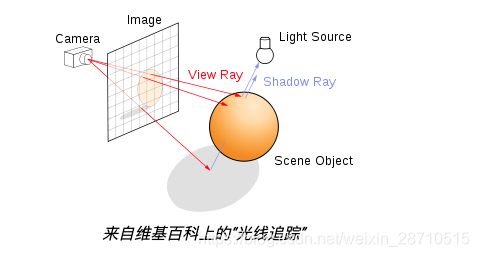

# Webgl
## Notice
1. useProgram
- 切换着色器，每次变更渲染对象都需要切换，包括变更uniform attribute等
2. bindBuffer
- 缓冲区更换然后通过vertexAttribPointer对attribute赋值
3. 通过顶点属性给片元着色器传参
- 如果要在同一个program里绘制完成所有的元素，每个元素区别仅仅片元颜色不同或者纹理
4. 关于纹理
- 全局变量默认为0，一般指代当前活跃纹理，会自动绑定当前着色器使用的sample2d
- 纹理切换
    ```javascript
        gl.activeTexture(gl.TEXTURE3); // 开启纹理3
        gl.bindTexture(gl.TEXTURE_2D, texture);
        // 着色器绑定到纹理3
        const u_imageLoc = gl.getUniformLocation(program, "u_image");
        gl.uniform1i(u_imageLoc, 3); // 使用第3个纹理单元
    ```  
5. 复用着色器
- 建议一个着色器绘制一个元素，通过uniform变化变更绘制，gl.drawArray绘制后 后续着色器Uniform变化也不会对已经绘制的元素产生影响 除非清空帧缓冲区。
6. 顶点着色器和片元着色器 传值
- 由于顶点数量（顶点）小于片元数量（内部填充元素），顶点attribute或者uniform数据往往数量不对等，所以在传值给片元都会进行插值。
- 纹理坐标，顶点坐标映射到纹理坐标上，片元需要插值将中间像素坐标映射到纹理坐标，纹理坐标上有对应rgba信息。
- uniform不支持传类似attribute数组，并且自动根据顶点位置取各自位置值。webgl2 有gl_VertexID可以获取顶点索引
- 传入顶点坐标逆时针正面，顺时针背面
## 基本流程
1. 创建顶点着色器
    ```javascript
        const glslCode = `
            attribute vec4 a_Position;
            uniform mat4 uModelViewMatrix;
            varying vec2 vTextureCoord;
            void main() {
              gl_Position = uModelViewMatrix * a_Position;
            }
        `
        const shaderVerext = gl.createShader(gl.VERTEX_SHADER);
        gl.shaderSource(shaderVerext, glslCode);
        gl.compileShader(shaderVerext);
    ```
2. 创建片元着色器
    ```javascript
        const glslCode = `
             // 片段着色器
             uniform sampler2D uTexture;
             varying vec2 vTextureCoord;
             void main() {
              gl_FragColor = texture2D(uTexture, vTextureCoord);
            }
        `
        const shaderFragment = gl.createShader(gl.FRAGMENT_SHADER);
        gl.shaderSource(shaderFragment, glslCode);
        gl.compileShader(shaderFragment);
    ```
3. 创建程序
    ```javascript
        const program = gl.createProgram();
        // 着色器链接
        gl.attachShader(program, shaderVerext);
        gl.attachShader(program, shaderFragment);
        gl.linkProgram(program);
    ```
4. 传attribute属性（顶点不同值不同）
   - 传顶点 
        ```javascript
            const buffer = gl.createBuffer();
            gl.bindBuffer(gl.ARRAY_BUFFER, buffer);
            gl.bufferData(gl.ARRAY_BUFFER, new Float32Array(data), gl.STATIC_DRAW);
            const positionLocation = gl.getAttribLocation(program, 'aPosition');
            gl.enableVertexAttribArray(positionLocation);
            gl.vertexAttribPointer(positionLocation, 3, gl.FLOAT, false, 0, 0);
        ```
5. 传uniform属性（顶点都共用）
    ```javascript
        const uLocation = gl.getUniformLocation(p, 'uModelViewMatrix');
        gl.uniformMatrix4fv(uLocation, false, new Float32Array([...变化矩阵]));
    ```
6. 传texture属性
    - 纹理坐标
        1. 告诉顶点着色器每个顶点对应的纹理坐标，通过varying插值给片元着色器
        2. 当片元着色器只使用一个纹理时候，默认可以不用指定纹理单元 默认为0
    ```javascript
        // 已加载IMAGE资源
        const texture = gl.createTexture();
        gl.bindTexture(gl.TEXTURE_2D, texture); //默认纹理0
        // 纹理坐标超出范围后采样方式
        gl.texParameteri(gl.TEXTURE_2D, gl.TEXTURE_WRAP_S, gl.REPEAT); // 重复
        // gl.texParameteri(gl.TEXTURE_2D, gl.TEXTURE_WRAP_T, gl.REPEAT); 
        // gl.texParameteri(gl.TEXTURE_2D, gl.TEXTURE_MIN_FILTER, gl.LINEAR);
        // gl.texParameteri(gl.TEXTURE_2D, gl.TEXTURE_MAG_FILTER, gl.LINEAR);
        gl.texImage2D(gl.TEXTURE_2D, 0, gl.RGBA, gl.RGBA, gl.UNSIGNED_BYTE, image); //上传纹理
        const textureLocation = gl.getUniformLocation(program, 'uTexture');
        gl.activeTexture(gl.TEXTURE0);
        gl.bindTexture(gl.TEXTURE_2D, texture);
        gl.uniform1i(textureLocation, 0);// t0
    ```
8. 相机
    ```javascript
        // 设置裁剪空间
        gl.viewport(0, 0, gl.canvas.width, gl.canvas.height);
    ```
    - 相机的位置可以根据投影矩阵变化顶点着色器
7. 绘图
    - 点
    - 线
    - 面
    ```javascript
        gl.drawArray();
        gl.drawElement();
    ```
## 纹理
- 渲染到纹理, 在渲染到画布
## shaderToy
- 绘制3D
    1. 光线追踪，将画布像素点映射到3D坐标
        - 假定一个摄像头位置 在其前面放置网格相当于画布，与假定场景中点到摄像头形成的射线 经过网格生成像素点
        
## Math
### 线性代数
#### 向量
#### 矩阵
- 变化矩阵
    1. 缩放
        `
            [Sx  0  0  0]
            [ 0 Sy  0  0]
            [ 0  0 Sz  0]
            [ 0  0  0  1]
        `
    2. 位移
        `
            [1  0  0  Tx]
            [0  1  0  Ty]
            [0  0  1  Tz]
            [0  0  0  1 ]
        `
    3. 旋转
         - x轴
            `
                [1     0      0  0]
                [0  cosθ  -sinθ  0]
                [0  sinθ   cosθ  0]
                [0     0      0  1]
            `
         - y轴
            `
                [ cosθ  0  sinθ  0]
                [    0  1     0  0]
                [-sinθ  0  cosθ  0]
                [    0  0     0  1]
            `
         - z轴
            `
                [cosθ -sinθ  0  0]
                [sinθ  cosθ  0  0]
                [  0      0  1  0]
                [  0      0  0  1]
            `
         - 任意轴
            1. 已知旋转向量(x,y,z)归一化
            2. 旋转角度...
- 线性相关与线性无关
## 着色器编程
### 套路
1. 颜色取反 1.0 - color
2. fract重复，除了网格重复，还可以偏移到网格中心
### 公式
1. fract
- 保留小数点 常用于归一化、网格划分
- 可作用于向量
2. smoothStep(min, max, value)
- 大于max 则返回max
- 小于min 则返回min
- 返回min,max区间插值
3. step(a, b)
- b >  a 则返回1
- b <= a 则返回0
- 常用于简写if else
4. distance(v_1, v_2)
- 计算两向量的距离
5. length(v)
- 向量长度
6. lerp(v1, v2, flag)
- 插值根据flag值 返回v1和v2向量直接的插值 （flag=.5，则表示v1 v2均匀混合
7. cross(v1, v2)
- 叉乘 求两向量的垂直向量
- 常用于计算光线法向量
8. dot(v1, v2)
- 点乘，求两向量的余弦值
- 常用于判断物体在相机的相对位置
10. normalize(v)
- 归一化坐标 长度变为1 方向不变
11. clamp(a, b, c)
- 取abc中间值
12. degrees(a)
- 弧度转角度
13. radians(a)
- 角度转弧度
14. mix(a, b, v)
- 根据v 的值插值 v <= 0 为a v>=1 为b 
- 可以根据此特性完成坐标状态变化
## webgl绘制粒子
0. 只需要一个顶点着色器一个片元着色器绘制
1. 设置所有粒子的初始状态包括位置传入缓冲区
    - 
       ```javascript
       const particleData = [
            // x, y, z, r, g, b, a
            0.0, 0.0, 0.0, 1.0, 1.0, 1.0, 1.0,
            0.5, 0.5, 0.0, 1.0, 0.0, 0.0, 1.0,
            //... more particles
        ];
    
        ```
2. 通过数学公式和uTime变化各个粒子的位置 
# Three.js
## Notice
1. three的轴 z是面向屏幕 y是垂直向上的
2. 修改材质，可能模型有共用的材质会导致修改一处材质全部发生变更，需要clone或覆盖模型材质
3. 渲染器，可以对多个相机和场景进行渲染（叠加）或者使用scissor 可一个画布分离多个渲染场景（相机不同）
4. 关于顶点着色器和片元着色器理解
    - 1. wegbl原生代码中有关于点、线、面绘制 几何最小单位是由三角形组成 使用Mesh 而点和线需要Point和Line
    - 2. 顶点着色器顾名思义传入的顶点，构成的片元区域，根据opengl的渲染流程，片元区域光栅化 经过片元着色器代码绘制颜色，由于顶点数量一定小于片元，所以会经过插值算法
    - 3. 片元着色器，gpu多线程运行，并且每个片元互不干扰 各自执行各自代码，导致无法信息交流，相当于局部绘制整体，不像canvas2d 可cpu去控制什么点绘制什么颜色（效率过低），因此通过贴图texture2d获取片元坐标所在的贴图颜色，这个坐标对应需要在构造几何传入attribute 相当于uvmap，将顶点和uv贴图进行映射，其他片元位置通过插值算法获取。 
5. mix还可实现过渡
## 结构
- 渲染器
- 场景
    - 模型
        - 几何
        - 材质
        - 着色器
        - 动画
- 相机
- 控制器
- 灯光
    
## Solution
### 精灵模型
- 特性 
    1. 固定平行摄像头
    2. 模拟粒子
- 用于天气模拟
### 贴图位移
- map.offset.x // x y 贴图偏移
- texture.wrapS = texture.wrapT = RepeatWrapping // 允许水平 垂直贴图重复
- texture.repeat.set(s, t) // 水平、垂直重复次数
### 射线选取
- raycaster.setFromCamer(new Vector2, camera) // 从相机位置发出射线
- raycaster.intersectObjects(mesh[]) // 判断射线有无经过mesh数组 返回穿过的mesh
### 材质修改
- 对Three现有材质进行着色器修改可以使用onBeforeCompile
    - 可传uniform
    - 使用replace插入额外添加着色器代码
- 遮罩纹理可以对uv贴图进行拾取
### 体积碰撞
- Three内置Box3,Sphere Box3.getBoundingSphere(sphere) 可以对获取包围盒的半径
# Cesium.js
- 经纬度转为笛卡尔坐标系

# HSL（色相、饱和度、亮度）
- Hue
- Saturation
- Lightness